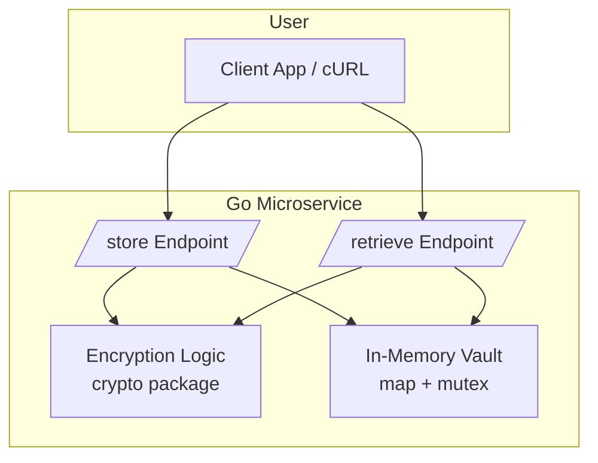
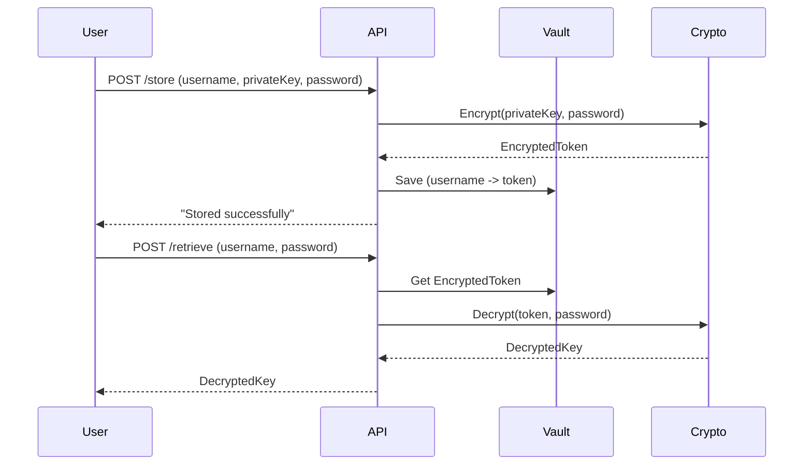

# 🔐 Crypto Vault API

> A simple and secure Go microservice for encrypting, storing, and retrieving crypto private keys using Fernet and PBKDF2-HMAC-SHA256.

---

## 📚 Table of Contents

- [🚀 Overview](#-overview)
- [📦 Technologies Used](#-technologies-used)
- [📐 Architecture](#-architecture)
- [🔁 Sequence Diagram](#-sequence-diagram)
- [🧪 API Endpoints](#-api-endpoints)
- [📖 Swagger UI](#-swagger-ui)
- [💻 Running the Project](#-running-the-project)
- [🧠 Security Notes](#-security-notes)

---

## 🚀 Overview

This microservice allows users to store their **private keys** securely by encrypting them with a password using `PBKDF2-HMAC` and `Fernet`. It includes a minimal HTTP API with two endpoints: `/store` and `/retrieve`.

---

## 📦 Technologies Used

| Tech         | Purpose                                  |
|--------------|-------------------------------------------|
| Go (Golang)  | Programming language                     |
| net/http     | Built-in Go HTTP server                  |
| fernet-go    | Symmetric encryption with token signing  |
| PBKDF2       | Password-based key derivation (SHA-256)  |
| swaggo       | Swagger/OpenAPI documentation generator  |

---

## 📐 Architecture



---

## 🔁 Sequence Diagram



---

## 🧪 API Endpoints

### 🔐 `POST /store`

Store a user's encrypted private key.

#### Request
```json
{
  "username": "alice",
  "private_key": "mySuperSecretKey",
  "password": "myStrongPassword"
}
```

#### Response
```
Stored successfully
```

---

### 🔓 `POST /retrieve`

Retrieve and decrypt a user's private key.

#### Request
```json
{
  "username": "alice",
  "password": "myStrongPassword"
}
```

#### Response
```
mySuperSecretKey
```

---

## 📖 Swagger UI

Swagger docs are auto-generated and served at:

```
http://localhost:8080/swagger/index.html
```

To regenerate them:

```bash
swag init
```

---

## 💻 Running the Project

### Prerequisites

- Go 1.18+
- `swag` CLI (`go install github.com/swaggo/swag/cmd/swag@latest`)

### Steps

```bash
# Clone repo
git clone https://github.com/0x11a0/demo-keystore
cd demo-keystore

# Install dependencies
go mod tidy

# Generate Swagger docs
swag init

# Run the app
go run main.go
```

App will be available at `http://localhost:8080`.

---

## 🧠 Security Notes

- 🔐 Passwords are not stored — only derived keys are used
- 🧂 PBKDF2 key derivation makes brute-force attacks slower
- 🪪 No authentication implemented — add JWT/Auth for production use
- 🗃 Data is stored in memory only — add persistent DB for real usage
- 🛡️ Use HTTPS in deployment to protect payloads in transit

---

## 👨‍💻 Author

[0x11a0](https://github.com/0x11a0)
